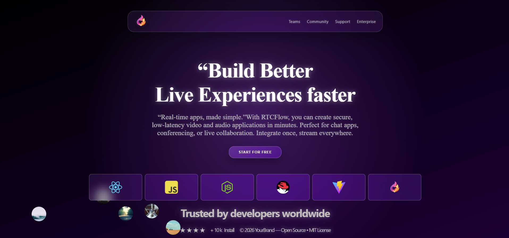
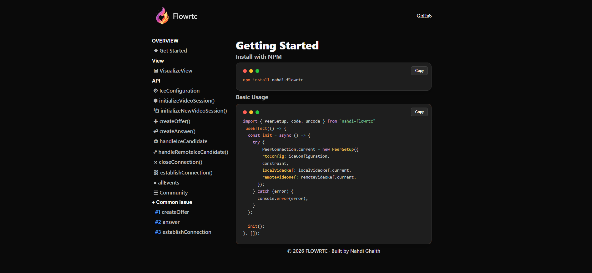

# 🚀 FlowRTC

**FlowRTC** is a lightweight, high-performance WebRTC library for building real-time peer-to-peer audio, video, and data streaming applications. Designed for simplicity and speed, it allows developers to integrate seamless P2P communication into web apps with minimal setup. Perfect for video chats, collaborative tools, and live streaming projects. 🔥

---

## 📸 Overview



---

## ⚡ Features

- Peer-to-peer audio, video, and data streaming
- Minimal setup, developer-friendly API
- Lightweight and fast
- Cross-browser support
- Perfect for video chats, collaboration apps, and live streaming

---

## 🛠️ Getting Started

Follow these simple steps to integrate **FlowRTC** into your project:



### Installation

```bash
npm install nahdi-flowrtc
```
